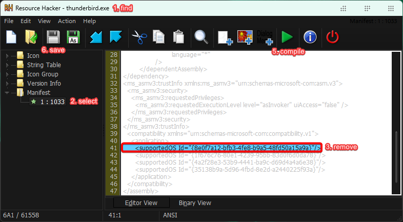

activate mica blur:
this works by removing Windows 10/11's supportedOS GUID (`{8e0f7a12-bfb3-4fe8-b9a5-48fd50a15a9a}`) in the manifest of Thunderbird's execuatable

- install then run [Resource Hacker](http://angusj.com/resourcehacker/) as admin

- follow the guide as shown here

- reboot for changes to take effect